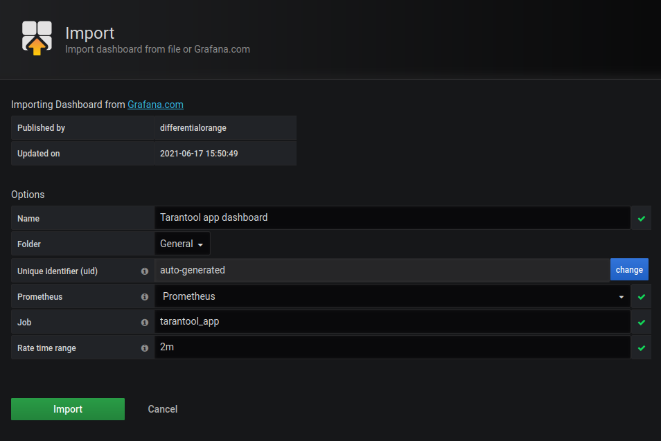

# Tarantool Grafana dashboard

Dashboard for Tarantool application and database server monitoring, based on [grafonnet](https://github.com/grafana/grafonnet-lib) library.

Our pages on Grafana Official & community built dashboards: [InfluxDB version](https://grafana.com/grafana/dashboards/12567), [Prometheus version](https://grafana.com/grafana/dashboards/13054).

Refer to dashboard [documentation page](https://www.tarantool.io/en/doc/latest/book/monitoring/grafana_dashboard/) for prerequirements and installation guide.

  


## Table of contents

- [Installation](#installation)
- [Monitoring cluster](#monitoring-cluster)
- [Manual build](#manual-build)
- [Contacts](#contacts)


## Installation

1. Open Grafana import menu.

	

2. To import a specific dashboard, choose one of the following options:

	- paste the dashboard id (``12567`` for InfluxDB dashboard, ``13054`` for Prometheus dashboard), or
	- paste a link to the dashboard (https://grafana.com/grafana/dashboards/12567 for InfluxDB dashboard,
  https://grafana.com/grafana/dashboards/13054 for Prometheus dashboard), or
	- paste the dashboard JSON file contents, or
	- upload the dashboard JSON file.

3. Set dashboard name, folder, uid, choose corresponding datasource from drop-down list and set datasource-related query parameters.

	

	You need to set the following variables for InfluxDB datasource:

	- `Measurement`,
	- `Policy` (default valie is `default`).

	You need to set the following variables for Prometheus datasource:

	- `Job`,
	- `Rate time range` (default valie is `2m`).

	Datasource variables can be obtained from your datasource configuration.
	Variables for example monitoring cluster are described in [Monitoring cluster](#monitoring-cluster) section.


## Monitoring cluster

For guide on setting up your monitoring stack refer to [documentation page](https://www.tarantool.io/en/doc/latest/book/monitoring/grafana_dashboard/).

This repository provides preconfigured monitoring cluster with example Tarantool app and load generatior for local development and tests. You can use them to build a monitoring cluster for your own app.

`docker-compose up -d` will start 6 containers: Tarantool App, Tarantool Load Generator, Telegraf, InfluxDB, Prometheus and Grafana, which build cluster with two fully operational metrics datasources (InfluxDB and Prometheus), extracting metrics from Tarantool App example project.
We recommend using the exact versions we use in experimental cluster (e.g. Grafana v6.6.0).

To set up an InfluxDB dashboard for monitoring example app, use the following variables:

- `Measurement`: `tarantool_app_http`;
- `Policy`: `default`.

To set up an Prometheus dashboard for monitoring example app, use the following variables:

- `Job`: `tarantool_app`;
- `Rate time range`: `2m`.


## Manual build

`go` v.1.14 or greater is required to install build and test dependencies.
Run `make build-deps` to install dependencies that are required to build dashboards.
Run `make test-deps` to install build dependencies and dependencies that are required to run tests locally.

You can compile Prometheus dashboard template with
```bash
jsonnet -J ./vendor/ ./dashboard/prometheus_dashboard.jsonnet
```
and InfluxDB dashboard template with
```bash
jsonnet -J ./vendor/ ./dashboard/influxdb_dashboard.jsonnet
```

To save output into `output.json` file, use
```bash
jsonnet -J ./vendor/ ./dashboard/prometheus_dashboard.jsonnet -o ./output.json
```
and to save output into clipboard, use
```bash
jsonnet -J ./vendor/ ./dashboard/prometheus_dashboard.jsonnet | xclip -selection clipboard
```

You can run tests with `make run-tests` command.
Compiled dashboard test files can be updated with `make update-tests` command.
It also formats all source files with `jsonnet`.


## Contacts

If you have questions, please ask it on [StackOverflow](https://stackoverflow.com/questions/tagged/tarantool) or contact us in Telegram:

- [Russian-speaking chat](https://t.me/tarantoolru)
- [English-speaking chat](https://t.me/tarantool)
