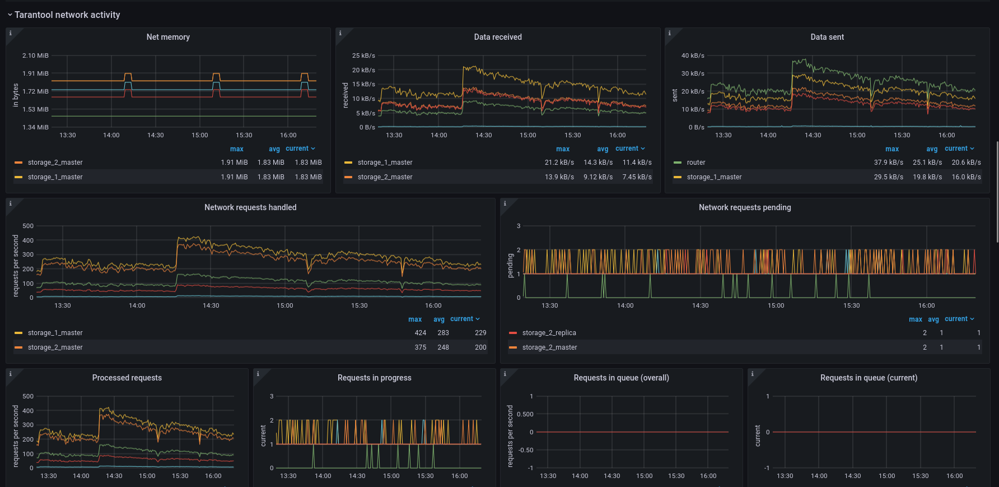

# Tarantool Grafana dashboard

Dashboard for Tarantool application and database server monitoring, based on [grafonnet](https://github.com/grafana/grafonnet-lib) library.

Our pages on Grafana Official & community built dashboards: [InfluxDB](https://grafana.com/grafana/dashboards/12567), [Prometheus](https://grafana.com/grafana/dashboards/13054).

Refer to dashboard [documentation page](https://www.tarantool.io/en/doc/latest/book/monitoring/grafana_dashboard/) for prerequirements and installation guide.

   

# How to build

## Requirements and setup

1. Install [go-jsonnet](https://github.com/google/go-jsonnet) compiler. We use v0.16.0. 

1. Install [jsonnet-bundler](https://github.com/jsonnet-bundler/jsonnet-bundler) package manager.

1. Install jsonnet package dependencies with ```jb install```.

## Experimental cluster

```docker-compose up -d``` will start 5 containers: Tarantool, Telegraf, InfluxDB, Prometheus and Grafana, which build cluster with two fully operational metrics datasources (InfluxDB and Prometheus), extracting metrics from Tarantool example project. We recommend using the exact versions we use in experimental cluster (e.g. Grafana v6.6.0). 

## How to compile dashboard

You can compile Prometheus dashboard template with
```bash
jsonnet -J ./vendor/ ./tarantool/prometheus_dashboard.jsonnet
```
and InfluxDB dashboard template with
```bash
jsonnet -J ./vendor/ ./tarantool/influxdb_dashboard.jsonnet
```

To save output into `output.json` file, use
```bash
jsonnet -J ./vendor/ ./tarantool/prometheus_dashboard.jsonnet -o ./output.json
```
and to save output into clipboard, use
```bash
jsonnet -J ./vendor/ ./tarantool/prometheus_dashboard.jsonnet | xclip -selection clipboard
```

## Tests

You can run tests with `./tests.sh` script. `jsonnet` and `jsonnetfmt` must be added to terminal PATH variable.
