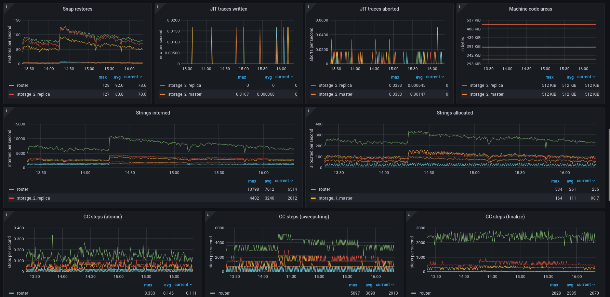

# Tarantool Grafana dashboard

Dashboard for Tarantool application and database server monitoring, based on [grafonnet](https://github.com/grafana/grafonnet-lib) library.

Our pages on Grafana Official & community built dashboards:
[InfluxDB version](https://grafana.com/grafana/dashboards/12567),
[Prometheus version](https://grafana.com/grafana/dashboards/13054),
[InfluxDB TDG version](https://grafana.com/grafana/dashboards/16405),
[Prometheus TDG version](https://grafana.com/grafana/dashboards/16406).

Refer to dashboard [documentation page](https://www.tarantool.io/en/doc/latest/book/monitoring/grafana_dashboard/) for prerequirements and installation guide.

  

<!-- START doctoc generated TOC please keep comment here to allow auto update -->
<!-- DON'T EDIT THIS SECTION, INSTEAD RE-RUN doctoc TO UPDATE -->
## Table of contents

- [Installation](#installation)
- [Monitoring cluster](#monitoring-cluster)
  - [Example app](#example-app)
  - [Monitoring local app](#monitoring-local-app)
- [Manual build](#manual-build)
- [Adding your panels](#adding-your-panels)
- [Contacts](#contacts)

<!-- END doctoc generated TOC please keep comment here to allow auto update -->

## Installation

1. Open Grafana import menu.

    

2. To import a specific dashboard, choose one of the following options:

    - paste the dashboard id (``12567`` for InfluxDB dashboard, ``13054`` for Prometheus dashboard,
      ``16405`` for InfluxDB TDG dashboard, ``16406`` for Prometheus TDG dashboard), or
    - paste a link to the dashboard (
      https://grafana.com/grafana/dashboards/12567 for InfluxDB dashboard,
      https://grafana.com/grafana/dashboards/13054 for Prometheus dashboard,
      https://grafana.com/grafana/dashboards/16405 for InfluxDB TDG dashboard,
      https://grafana.com/grafana/dashboards/16406 for Prometheus TDG dashboard), or
    - paste the dashboard JSON file contents, or
    - upload the dashboard JSON file.

3. Set dashboard name, folder and uid (if needed).

    

4. Choose datasource and datasource variables on the dashboard.

    


## Monitoring cluster

For guide on setting up your monitoring stack refer to [documentation page](https://www.tarantool.io/en/doc/latest/book/monitoring/grafana_dashboard/).

### Example app

This repository provides preconfigured monitoring cluster with example Tarantool app and load generatior for local dashboard development and tests.

```bash
docker compose up -d
```
will start 6 containers: Tarantool App, Tarantool Load Generator, Telegraf, InfluxDB, Prometheus and Grafana, which build cluster with two fully operational metrics datasources (InfluxDB and Prometheus), extracting metrics from Tarantool App example project.
We recommend using the exact versions we use in experimental cluster (e.g. Grafana v8.1.5).
After start, Grafana UI will be available at [localhost:3000](http://localhost:3000/).
You can also interact with Prometheus at [localhost:9090](http://localhost:9090/) and InfluxDB at [localhost:8086](http://localhost:8086/).

### Monitoring local app

If you want to monitor Tarantool cluster deployed on your local host, you can use monitoring cluster similar to example app one.

Configure Telegraf/Prometheus to monitor your own app in `example_cluster/telegraf/telegraf.localapp.conf` and `example_cluster/prometheus/prometheus.localapp.yml`.
Use `host.docker.internal` as your machine host in configuration and set cluster instances ports as targets and correct metrics HTTP path.
See more setup tips in [documentation](https://www.tarantool.io/en/doc/latest/book/monitoring/grafana_dashboard/).

Start cluster with 
```bash
docker compose -f docker-compose.localapp.yml -p localapp-monitoring up -d
```
After start, Grafana UI will be available at [localhost:3000](http://localhost:3000/).
You can also interact with Prometheus at [localhost:9090](http://localhost:9090/) and InfluxDB at [localhost:8086](http://localhost:8086/).

## Manual build

`go` v.1.14 or greater is required to install build and test dependencies.
Run
```bash
make build-deps
```
to install dependencies that are required to build dashboards.

Run
```bash
make test-deps
```
to install build dependencies and dependencies that are required to run tests locally.

To build a custom dashboard, run `make build` command with your specific configuration.

```bash
make CONFIG=config.yml OUTPUT=mydashboard.json build
```

See repository example config [config.yml](config.yml) for detailed info about supported options.

You can run tests with
```bash
make run-tests
```

Compiled dashboard test files can be updated with
```bash
make update-tests
```
It also formats all source files with `jsonnetfmt`.


## Adding your panels

If you're interested in building grafonnet dashboards or custom panels,
I suggest you to start with reading our grafonnet tutorial:
[in English](https://medium.com/@tarantool/grafana-as-code-b642cac9ae75),
[in Russian](https://habr.com/ru/company/vk/blog/577230/).

You can add your own custom panels to the bottom of the template dashboard.

1. Add tarantool/grafana-dashboard as a dependency in your project with jsonnet-bundler.
    Run
    ```bash
    jb init
    ```
    to initialize jsonnet-bundler and add this repo to `jsonnetfile.json` as a dependency:
    ```json
    {
      "version": 1,
      "dependencies": [
        {
          "source": {
            "git": {
              "remote": "https://github.com/tarantool/grafana-dashboard"
            }
          },
          "version": "master"
        }
      ],
      "legacyImports": true
    }
    ```
    Run
    ```bash
    jb install
    ```
    to install dependencies. [`grafonnet`](https://github.com/grafana/grafonnet-lib) library will also be installed as a transitive dependency.

2. Load a configuration, same as in ["Manual build"](#manual-build) section. (You can build it as a dictionary in code instead of parsing a YAML file.)
    ```jsonnet
    # my_dashboard.jsonnet
    local config = import 'grafana-dashboard/dashboard/build/config.libsonnet';
    local raw_cfg = importstr 'config.yml';

    local cfg = config.prepare(std.parseYaml(raw_cfg));
    ```

3. Import the main template.
    ```jsonnet
    # my_dashboard.jsonnet
    local dashboard = import 'grafana-dashboard/dashboard/build/dashboard.libsonnet';
    ```

4. To add your custom panels to a dashboard template, you must create panel objects.

    A row panel can be created by using the following script:
    ```jsonnet
    # my_dashboard.jsonnet
    local common = import 'grafana-dashboard/dashboard/panels/common.libsonnet';

    local my_row = common_panels.row('My custom metrics')
    ```

    Panel with metrics data consists of a visualisation base (graph, table, stat etc.) and one or several datasource queries called "targets". To build a simple visualization graph, you may use `common.default_graph` util.

    ```jsonnet
    # vendor/grafana-dashboard/dashboard/panels/common.libsonnet

    default_graph( # graph panel shortcut
      cfg, # Dashboard configuration
      title, # The title of the graph panel
      description, # (optional) The description of the panel
      format, # (default 'none') Unit of the Y axes
      min, # (optional) Min of the Y axes
      max, # (optional) Max of the Y axes
      labelY1, # (optional) Label of the left Y axis
      decimals, # (default null) Override automatic decimal precision for legend and tooltip
      decimalsY1, # (default null) Override automatic decimal precision for the left Y axis
      legend_avg, # (default true) Show average in legend
      legend_max, # (default true) Show max in legend
      panel_height, # (default 8) Panel heigth in grid units
      panel_width, # (default 8) Panel width in grid units, max is 24
    )
    ```
    Panel size is set with grid units. Grafana uses square-type grid where dashboard width is 24 units. For example, row size is 24 x 1 units and Grafana new panel size is 12 x 9 units.

    If you want to build non-graph panel or a graph panel with more complicated configuration, use `grafonnet` templates.
    You must set a size of each panel before adding it to our dashboard template.
    For each `grafonnet` panel, add `{ gridPos: { w: width, h: height } }` to it.
    For example,
    ```jsonnet
    local grafana = import 'grafonnet/grafana.libsonnet';

    local my_graph = grafana.graphPanel.new(
      title='My custom panel',
      points=true,
    ) { gridPos: { w: 6, h: 4 } };
    ```

    To build a target, you should use `common` utils.
    ```jsonnet
    # vendor/grafana-dashboard/dashboard/panels/common.libsonnet

    target( # plain "select metric" shortcut
      cfg, # Dashboard configuration
      metric_name, # Target metric name to select
      additional_filters, # (optional) Query additional filter conditions. The structure is{ prometheus: filters, influxdb: filters }, filters have the same format as in cfg
      legend, # (optional) Target result legend. The structure is{ prometheus: legend_str, influxdb: legend_str }
      group_tags, # (InfluxDB only, optional). Target result group rules. All tags used in legend are expected to be here too
      converter, # (InfluxDB only, default 'mean') InfluxDB metrics converter (aggregation, selector, etc.)
      rate, # (default false) Whether to transform the metrics as rate
    ),
    ```

    To build more compound targets, use `grafonnet` library `prometheus` and `influxdb` templates.

    To add a target to a panel, call `addTarget(target)`.

    To summarise, you can build a simple 'select metric' panel with
    ```jsonnet
    local common = import 'grafana-dashboard/dashboard/panels/common.libsonnet';
    local variable = import 'grafana-dashboard/dashboard/variable.libsonnet';

    local my_custom_component_memory_graph = common.default_graph(
      cfg,
      title='My custom component memory',
      description=|||
        My custom component used memory.
        Shows mean value.
      |||,
      format='bytes',
      panel_width=12,
      panel_height=6,
    ).addTarget(common.target(cfg, 'my_component_memory'))
    ```
    and a simple rps panel with
    ```jsonnet
    local common = import 'grafana-dashboard/dashboard/panels/common.libsonnet';
    local variable = import 'grafana-dashboard/dashboard/variable.libsonnet';

    local my_custom_component_rps_graph = common.default_graph(
      cfg,
      title='My custom component load',
      description=|||
        My custom component processes requests
        and collects info on process to summary collector
        'my_component_load_metric'.
      |||,
      labelY1='requests per second',
      panel_width=18,
      panel_height=6,
    ).addTarget(common.target(cfg, my_component_load_metric_count', rate=true))
    ```
    For more panel tips and examples, please examine this template dashboard source code and test cases.

    To add your custom panels, call `addPanel(panel)` or `addPanels(panel_array)` in dashboard template:
    ```jsonnet
    # my_dashboard.jsonnet
    local dashboard = import 'grafana-dashboard/dashboard/build/dashboard.libsonnet';

    ...
    
    local my_dashboard_template = dashboard.addPanels([
      my_row, my_custom_component_memory_graph, my_custom_component_rps_graph
    ]);
    ```

    Finally, call `build()` to compute panels positions and build a resulting dashboard:
    ```jsonnet
    # my_dashboard.jsonnet
    ...
    my_dashboard_template.build()
    ```
    Do not use `;` in the end of your script so resulting dashboard will be returned as output.

4. To save resulting dashboard into `output.json` file, use
    ```bash
    jsonnet -J ./vendor/ my_dashboard.jsonnet -o ./output.json
    ```
    and to save output into clipboard, use
    ```bash
    jsonnet -J ./vendor/ my_dashboard.jsonnet -o ./output.json | xclip -selection clipboard
    ```

## Contacts

If you have questions, please ask it on [StackOverflow](https://stackoverflow.com/questions/tagged/tarantool) or contact us in Telegram:

- [Russian-speaking chat](https://t.me/tarantoolru)
- [English-speaking chat](https://t.me/tarantool)
